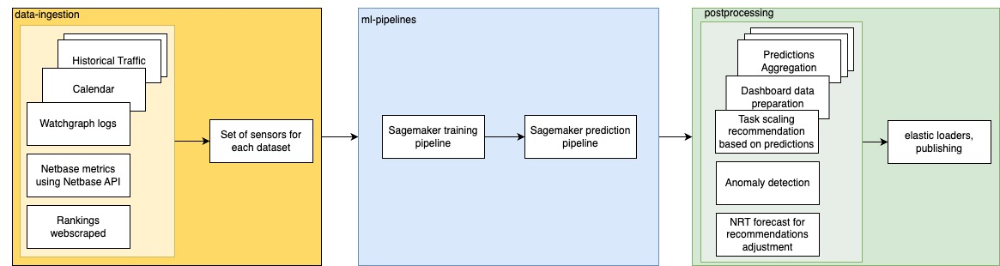

# Sport traffic prediction using AWS Sagemaker

This project presents a code for building Amazon SageMaker Pipelines (**ml-pipelines**) to create end-to-end workflows that manage and deploy SageMaker jobs aimed to train models and predict time series of sport events requests traffic with 10 days horizon on the hockey example

The project also contains additional examples of **data-ingestion** steps and **postprocessing** steps which supposed to be managed separately.

The e2e DAG is composed in MWAA (Amazon Airflow) and simplified schema is below

**Data ingestion** part includes ingesting data from various sources: Newrelic, Datadog, client's internal databases, APIs, logs and others.
Presented examples: 
- data-ingestion/**netbase_ingestion** consists of
    - *scripts* for obtaining social networks metrics, such as the estimated number of people who might have viewed an author's posts or the total number of mentions matching a query, containing the sport events artifacts. These metrics are ingested using third-party Insight API.
    - *airflow* which contains .py file with DAG building
    - *test* with tests for checking DAG creation

- data-ingestion/**rankings_ingestion** contains a file for scraping the webpage with the men-hockey-college rankings

Data ingestion part of the e2e DAG also includes steps with various data transformations and filtering, preparing dataset for using in ml-pipelines.

For running **ML pipelines** local_vars.sh should be filled with appropriate variables. 
It suppose having an access to AWS platform. 
Then, pipelines can be triggered by running *start_pipeline.sh* which run *run_pipeline.py* with some arguments, which in its turn uses functions from *project.py* and *_utils.py*. 
Besides, *run_pipeline.py* compose the configuration by joining dictionaries with various settings from *configs* folder. It's made versatile to allow creating configuration for several sports, services and regions. The approximate example of the final configuration can be found in config_hockey.py
The configuration dictionary primarily includes environment variables, constant variables, paths to input files and data dictionaries, settings for which features to utilize, and model hyperparameters.

ml-pipelines/pipelines/**train** and ml-pipelines/pipelines/**prediction** includes the corresponding pipelines definitions and python scripts for some steps.

The **training pipeline** of sports models involves the following steps:

1. **collect** step is ingesting and storing features and involves utilizing all available information from watchgraph logs and the most recent service traffic to create target variables. Additionally, some external features, such as netbase features, rank features are added during this step. As per the instructions specified in the configuration files, event calendar features are also added. For instance, features like "use_competition_features", "use_date_features", "use_league_features", and "use_media_features" are added based on the configuration settings. Features are stored in *Sagemaker Feature Store*
2. in the **prepare** step, features are read from a feature store. During this step, the features are scaled and encoded if necessary, and the Scaler and Encoder objects are saved as pickle files to specific paths. The model data is split into training and validation datasets, and a dataset for future events is prepared for predictions.
3. the **train** step involves using a native Sagemaker XGBoost model and the training dataset. 
4. **evaluate**: predictions are made on the validation dataset, and metrics such as MAE, MAPE, and SMAPE are calculated. These metrics can be viewed on Model Quality dashboard.
5. **approve**: if the metrics meet the required standards, the model is approved and registered in *Sagemaker Model Registry*, and the Encoder and Scaler path are attached to the trained and approved model. 
6. **notify**: a notification is then sent to Slack regarding the newly trained model.

The **prediction pipeline** of sports models consists of the following steps:
1. **collect** step is the same as in training pipeline.
2. **prepare** features step functions similarly to prepare step in training pipeline except it reads the scaler and encoder from paths where they were saved during training.
3. **prediction**: predictions are made with the last approved model from *Model Registry* on prediction dataset.
4. **postprocess** predictions: timestamps attached to predicted values